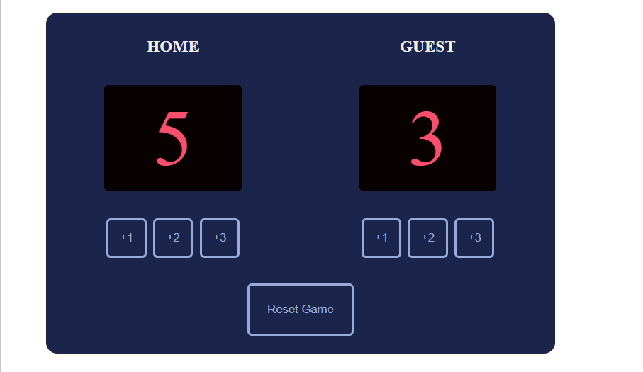

# 🏀 Basketball Scoreboard

A simple and interactive Basketball Scoreboard application built using **HTML**, **CSS**, and **JavaScript**. This project allows users to keep track of scores for the Home and Guest teams with dedicated score buttons and a reset option.

## 🚀 Features

* Increase Home team score by **+1**, **+2**, or **+3**
* Increase Guest team score by **+1**, **+2**, or **+3**
* Reset both scores to **0**
* Clean and responsive user interface
* Built using vanilla JavaScript without any frameworks

## 🛠️ Technologies Used

* HTML5
* CSS3
* JavaScript (ES6)

## 📂 Project Structure

```text
basketball-scoreboard/
│── index.html
│── index.css
│── index.js
│── README.md
```

## ▶️ How to Run the Project

1. Clone this repository:

```bash
git clone https://github.com/chendkapure-vansh/basketball-scoreboard.git
```

2. Open the project folder.

3. Double-click **index.html** or open it in your preferred web browser.


```md id="fiximg"
## 📸 Project Preview



## 🎯 Learning Outcomes

Through this project, I practiced:

* DOM Manipulation
* JavaScript Event Handling
* Updating UI Dynamically
* HTML & CSS Layout using Flexbox
* Basic Git and GitHub Workflow

## 👨‍💻 Author

**Vansh Chendkapure**

GitHub: https://github.com/chendkapure-vansh

---

⭐ If you found this project helpful, consider giving it a star on GitHub!
